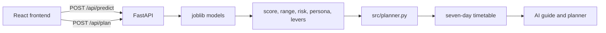

# StudyPilot

An AI study planner that predicts an exam score, classifies risk, names a study persona, and builds a week that changes with those three decisions.

[](https://github.com/Hariti076/studypilot/actions/workflows/ci.yml)

## Live Demo

**Live Demo: [https://studypilot-2xq5.vercel.app](https://studypilot-2xq5.vercel.app)**

Open the link, create an account, and go to **Inputs**. Choose **Fill sample data**, then open the dashboard. The AI guide shows the predicted score with a range, a colour-coded risk level, and a named persona. The planner turns that reading into a seven-day timetable: red sessions first, amber next, green when the subject can wait.

Accounts stay in the browser. Predictions come from the models in [`models/`](models/).

## Overview

Students often revise whatever is in front of them. A week that ignores attendance, sleep, and which exam is soon spends time on the wrong subject. StudyPilot treats the week as a decision: estimate how the student is likely to score, say how risky that position is, describe the study habit that fits them, and schedule from those facts.

The models are trained on the synthetic [Student Performance Factors](https://www.kaggle.com/datasets/lainguyn123/student-performance-factors) table (6,607 rows). The metrics show that the pipeline is stable on that table. They are evidence about the pipeline, and the app presents every score as an estimate with a range.

## Key Features

- **Score prediction.** Linear regression estimates one student-level exam score. The dashboard shows it with a confidence range, about ±1.27 marks.
- **Risk classification.** Logistic regression labels the week High, Medium, or Low. The UI colours that label and names the habits that pushed it.
- **Persona detection.** K-Means (k = 4) assigns Consistent Attender, Tutoring-Supported, Low Motivation, or Irregular Attender, with a short description and tips.
- **Adaptive study planner.** Session length, task type, and priority follow the score, the risk, and the persona. Missed work moves forward. Finished work can lengthen the next sessions. A stalled week shortens the lighter ones.
- **Progress tracking.** Streak, weekly completion, and today’s finished sessions stay on the dashboard.
- **AI guidance.** The guide summarises the week in plain sentences: why the risk was assigned, which subject should come first, and how the persona changes the timetable.

## Machine Learning

Training, evaluation, and the model card live in [`src/train.py`](src/train.py), [`src/evaluate.py`](src/evaluate.py), [`notebooks/`](notebooks/), and [`reports/MODEL_CARD.md`](reports/MODEL_CARD.md). The app loads the saved estimators. It does not retrain them at request time.

The split recorded with the shipped models is 5,285 train / 1,322 test, stratified by risk. Cross-validation runs on the training set. The test set is used once for the figures below. Full precision is in [`models/metadata.json`](models/metadata.json).

### Models Used

| Task | Model | Why it is the one that ships |
| --- | --- | --- |
| Score prediction | Linear Regression | Lowest cross-validated RMSE among the candidates in [`reports/regression_results.csv`](reports/regression_results.csv). Test RMSE 2.53 against a mean-baseline RMSE of 4.15. |
| Risk detection | Logistic Regression | Highest cross-validated macro-F1 in [`reports/classification_results.csv`](reports/classification_results.csv). Test macro-F1 0.875 against a majority-class F1 of 0.232. |
| Persona | K-Means, k = 4 | Fit on study-habit features. Each cluster is named after the habit that most separates it from the average student. |

Risk labels come from score bands in the metadata: High below 65, Medium below 70, Low from 70 upward. Personas are Consistent Attender, Tutoring-Supported, Low Motivation, and Irregular Attender.

Tree models were trained and compared. On this table the score relationship is close to linear, so linear regression and logistic regression match or beat random forest and gradient boosting, and they overfit less. See [`reports/overfitting_check.csv`](reports/overfitting_check.csv).

### Metrics

Shipped test metrics from [`models/metadata.json`](models/metadata.json):

| Check | Result |
| --- | --- |
| Regression, all test rows | MAE 0.86, RMSE 2.53, R² 0.626 |
| Regression, typical rows | RMSE 0.814, R² 0.941 |
| Score range shown in the app | ±1.27 marks. Covers 86.5% of all test rows and 87.3% of typical rows |
| Classification | Accuracy 0.876, macro-F1 0.875, ROC-AUC 0.975, high-risk recall 0.904 |
| Clustering | Silhouette 0.127 at k = 4 |

**What those numbers mean.** Typical rows, inside the normal score band, are predicted tightly: R² 0.941 and an error small enough to show as ±1.27. Across every test row, R² falls to 0.626 because 11 extreme scores sit outside that band and dominate squared error. The classifier separates risk well (ROC-AUC 0.975) and still catches most high-risk students (recall 0.904). The silhouette of 0.127 is weak, and the k sweep is nearly flat (k = 2 is 0.127 as well). k = 4 is kept because the four habit names are usable in a plan. Personas are soft segments, and the UI treats them that way: a study style with a tip, plus a session-length rule.

`python -m src.evaluate` reloads `models/` and repeats a stratified 80/20 split with `random_state=42`. That split is a different fold from the one that produced `metadata.json`. Silhouette lands within 0.02. The score and risk metrics do not, so `src/evaluate.py` exits with status 1. The same gap appears under scikit-learn 1.6.1 and 1.9.1. The joblib files in `models/` were left as shipped.

### Feature Selection

The model uses 13 raw inputs plus four engineered features: Engagement Index (attendance with hours), Sleep Deficit, Prior × Effort, and a numeric motivation level. That is the compact set of 17 features in the ablation table.

Six columns are left out: Gender, Family Income, Parental Education Level, Learning Disabilities, School Type, and Distance from Home. They are sensitive, or they are not something a weekly study plan should act on.

The cost is measured in [`reports/feature_ablation.csv`](reports/feature_ablation.csv), on typical test rows:

| Feature set | Typical RMSE | Typical R² | Change vs compact |
| --- | ---: | ---: | ---: |
| All 23 features | 0.345 | 0.989 | −57.7% |
| Compact 17 features (used) | 0.814 | 0.941 | 0 |
| Compact + Family Income | 0.710 | 0.955 | −12.7% |
| Compact + Parental Education | 0.704 | 0.956 | −13.6% |
| Compact + Learning Disabilities | 0.747 | 0.950 | −8.3% |
| Compact + Distance from Home | 0.735 | 0.952 | −9.7% |
| Compact + Gender | 0.814 | 0.941 | ~0 |
| Compact + School Type | 0.814 | 0.941 | ~0 |

Dropping the six columns makes the typical-row fit worse. Gender and school type add almost nothing on their own. Income, parental education, learning disabilities, and distance account for most of the gap. The compact set is the one that ships, on purpose.

### Explainability

Each prediction is explained from the saved linear models. Nothing is refit at request time.

- **Score.** For the student’s prepared row, each feature’s value is multiplied by the linear-regression coefficient. The largest contributions are returned as factors that lift the score or pull it down. The dashboard turns a downward factor into a sentence such as “Attendance raised the risk.”
- **Risk.** The same idea uses the logistic-regression coefficient of the predicted class, so the UI can say which habits pushed the label toward High, Medium, or Low.
- **Levers.** The regressor is scored again after small, realistic routine changes: attendance toward 90 if it is below that, about 3.5 more weekly hours, sleep moved to 8 when it sits outside 7–9, one more tutoring session when under four, motivation up one level, and physical activity up one hour when under four. The combined gain, floored at zero, is `plan_gain`. That number is what the planner spreads across subjects.
- **Range.** The point prediction is shown with the shipped ±1.27 band, so the UI says “about 64–67” and treats the mark as an estimate.

Figures: [explainability](reports/figures/explainability_importance.png), [regression](reports/figures/regression_results.png), [confusion matrix](reports/figures/classification_confusion.png), [persona clusters](reports/figures/clustering_personas.png).

## Planner Logic

The planner is the part that makes the models useful. `POST /api/predict` runs the three models once. `POST /api/plan` does not rescore the student. It allocates the week from that prediction. The rules live in [`src/planner.py`](src/planner.py).

**One student call, then a subject projection.** Previous score is the mean of the subject marks, so the regressor runs once. Each subject then receives a share of `plan_gain`, larger when it is further from 100:

`projected = clamp(current + plan_gain × (100 − current) / mean(100 − current), 0, 100)`

Subject risk is a rule on that projection: High under 55, or under 65 with 10 days or fewer left; Medium under 70; otherwise Low. Overall risk is the classifier label, raised from Low to Medium if any subject is High.

**Priority.** Each subject gets a score, then a label:

`(100 − projected) × 0.6 + difficulty × 5 + urgency + risk bonus`

Urgency grows as the exam enters the next 30 days. The risk bonus is 18 for High, 8 for Medium, and 0 for Low. A subject is High priority when its risk is High or the score is at least 55, Medium from 38, and Low below that. The timetable paints those labels red, amber, and green, and each session carries a short reason (“current mark needs the time”).

**Persona changes the shape of the day.**

| Persona | High-priority session | Lighter session | What the week emphasises |
| --- | ---: | ---: | --- |
| Low Motivation | 45 min | 25 min | Short starts, a fixed time, a reward after the block |
| Irregular Attender | 60 min | 30 min | Class first, then shorter and more frequent catch-up |
| Tutoring-Supported | 75 min | 45 min | Room to prepare questions and revise the same topic that day |
| Consistent Attender | 90 min | 45 min | Longer blocks; later sessions become harder practice |

Sunday is about 70% of a weekday. The day starts at the student’s peak-energy time and is meant to finish by 10 PM. Task wording also follows the persona and the exam date, so an irregular attender is told to sit the class before opening a textbook, and a low-motivation day starts with a 25-minute block.

**The week adapts after it is built.**

- A session dated in the past and still open is carried onto today or a later day, marked as moved.
- After two completed sessions in a subject, remaining sessions in that subject gain 10 minutes, capped at 120, and are marked harder.
- If the plan is at least two days old, under a quarter of the study sessions are done, and nothing has been eased yet, remaining low-priority sessions lose 15 minutes (floor 25) and are marked catch-up.

The dashboard states which of those changes just happened, so the student can see the plan move.

## System Architecture



1. The React app collects subjects, marks, exam dates, and habits.
2. FastAPI (`api/main.py`) validates the profile and calls the model service.
3. The model service loads Linear Regression, Logistic Regression, and K-Means from `models/`, prepares the row with the same feature code used in training, and returns the score, the range, the risk probabilities, the persona, the coefficient explanation, and the levers.
4. The planner turns that reading into sessions. It does not call the models again.
5. The UI shows the decision in sentences: predicted score and range, coloured risk, “You are [persona]”, why that risk, why a subject is first, and a week whose lengths follow the persona.

Locally, Vite proxies `/api` to port 8000. On Vercel, [`vercel.json`](vercel.json) serves the React build and the FastAPI app on the same host. `GET /api/health` reports the three model names. `POST /api/predict` and `POST /api/plan` are the two calls the app makes. Invalid input returns HTTP 422 with a readable message.

## Tech Stack

**Frontend**

- React 18, React Router 6, Vite 5
- Tailwind CSS
- Recharts for the score charts
- Lucide for icons

**Backend**

- FastAPI, Pydantic, Uvicorn
- Joblib model loading, with a small compatibility layer so estimators trained on scikit-learn 1.6.1 load on a newer release

**Machine learning**

- scikit-learn (linear regression, logistic regression, K-Means, and the comparison models)
- pandas, NumPy
- Matplotlib for the report figures

## Project Structure

The repository keeps the API, the training code, and the saved models in separate folders. There is no separate `backend/` or `ml/` directory: `api/` is the backend, and `src/` plus `models/` are the machine-learning pipeline.

```text
studypilot/
├── api/             FastAPI app, schemas, model service, plan endpoint
├── frontend/        React app (dashboard, planner, inputs, progress)
├── src/             features, training, evaluation, planner
├── models/          shipped joblib files and metadata.json
├── notebooks/       EDA, preprocessing, modeling, evaluation
├── reports/         model card, metric tables, figures
├── data/            dataset notes; the CSV is not committed
├── tests/
├── requirements.txt
└── vercel.json
```

## Setup

Tested on Python 3.12 with scikit-learn 1.6.1 and on Python 3.14 with scikit-learn 1.9.1. The shipped models were trained with 1.6.1.

**Backend**

```bash
pip install -r requirements.txt
python -m uvicorn api.main:app --host 127.0.0.1 --port 8000
```

**Frontend**

```bash
cd frontend
npm install
npm run dev
```

Open http://localhost:5173. Create an account, open Inputs, and use Fill sample data.

**Tests**

```bash
pip install -r requirements-dev.txt
python -m pytest -q
```

Retraining writes to `artifacts/` and leaves `models/` unchanged:

```bash
python -m src.train --data data/StudentPerformanceFactors.csv --out artifacts
```

The CSV is downloaded separately. Steps are in [`data/README.md`](data/README.md). Leave `VITE_API_URL` empty so the dev server proxies `/api`.

## Screenshots

Captures for the submission deck go in `docs/screenshots/`. Until those files are added, the same views are on the [live demo](https://studypilot-2xq5.vercel.app).

| View | What to capture | File |
| --- | --- | --- |
| Dashboard | AI guide with the score range, coloured risk, and “You are [persona]” | `docs/screenshots/dashboard.png` |
| Planner | The week with red, amber, and green sessions and a reason on each block | `docs/screenshots/planner.png` |
| AI insights | Habit sentences, persona schedule line, and the subject priority cards | `docs/screenshots/insights.png` |

## Future Improvements

- Persist the plan on a server and replace the browser-local account with real authentication.
- Store the training-row indices so evaluation can reproduce `metadata.json` on the same fold.
- Update the plan from a rolling window of completed sessions, closer to real-time adaptation than the current login-time rules.
- A mobile layout aimed at checking off today’s block.
- Finer personalisation once a student has several weeks of their own history, still without putting the dropped sensitive columns back into the model.

## Conclusion

StudyPilot is a study assistant built around three model outputs and a planner that has to use all three. The score says where the student stands, the risk says how hard to push, and the persona says what length of session they will actually start. The week is then rescheduled when sessions are missed, stretched when work is finished, and eased when the week stalls. The explanations on the dashboard are the model’s own coefficients and levers, written as sentences a student can act on.

That combination — a checked model pipeline, a visible decision, and a timetable that moves — is the project.

Dataset: [Student Performance Factors](https://www.kaggle.com/datasets/lainguyn123/student-performance-factors) by lainguyn123 on Kaggle. Repository: [github.com/Hariti076/studypilot](https://github.com/Hariti076/studypilot).
