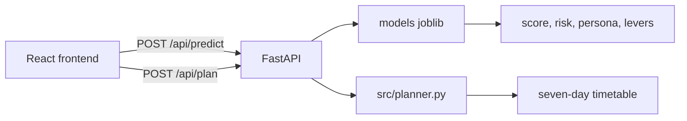

# StudyPilot

An AI study planner: trained models estimate a student's exam score, risk, and study persona, and the app turns that into a weekly timetable.

[](https://github.com/Hariti076/studypilot/actions/workflows/ci.yml)

**Live demo:** TODO. A Vercel project was started from this repo; the production URL was not available when this README was written.

## Problem

Students often revise whatever is in front of them. A week that ignores attendance, sleep, and which exam is soon spends time on the wrong subject.

This project asks a narrower question of the [Student Performance Factors](https://www.kaggle.com/datasets/lainguyn123/student-performance-factors) table: which study habits move with the exam score, and which simple model is stable enough to suggest a routine? The table is synthetic, so the answer is about the pipeline, not about real classrooms.

The web app collects subjects and habits, calls the saved models once for the student, projects each subject from that gain, and builds a seven-day plan. Accounts stay in the browser. The models are the joblib files in [models/](models/).

## What the app does

You enter subjects, marks, exam dates, and a routine. `POST /api/predict` returns a student-level score, risk probabilities, a persona, and the routine changes ("levers") that the regressor associates with a higher score. Each subject then gets a projected mark: current score plus a share of that gain. `POST /api/plan` turns the projection into sessions. The dashboard shows today's list, the week, and the model card.

## Architecture



Predict uses the models. Plan does not rescore the student; it allocates time from the prediction.

## Dataset

Source: [Student Performance Factors](https://www.kaggle.com/datasets/lainguyn123/student-performance-factors) (lainguyn123). 6,607 rows after the file is loaded, 20 columns. The set is synthetic. Download steps are in [data/README.md](data/README.md).

Six columns are not model inputs: Gender, Family_Income, Parental_Education_Level, Learning_Disabilities, School_Type, Distance_from_Home. They are sensitive or not something a study plan should act on. The cost is in [reports/feature_ablation.csv](reports/feature_ablation.csv). On typical test rows the compact 17-feature set has RMSE 0.813950631477089 and R² 0.9406927985409775. All 23 features have typical RMSE 0.34454209387578516, a change of -57.670394179738004% versus the compact set. Dropping those columns makes the typical-row fit worse. That trade-off is deliberate.

## Machine learning pipeline

| Brief item | Where it lives |
| --- | --- |
| Problem identification | This page, and [notebooks/01_eda.ipynb](notebooks/01_eda.ipynb) |
| Dataset selection | [data/README.md](data/README.md), [reports/MODEL_CARD.md](reports/MODEL_CARD.md) |
| Preprocessing | [src/features.py](src/features.py), [notebooks/02_preprocessing.ipynb](notebooks/02_preprocessing.ipynb) |
| Algorithm selection | [reports/regression_results.csv](reports/regression_results.csv), [reports/classification_results.csv](reports/classification_results.csv), [notebooks/03_modeling.ipynb](notebooks/03_modeling.ipynb) |
| Model building | [src/train.py](src/train.py). Shipped estimators: [models/](models/) |
| Parameter tuning | RandomizedSearchCV inside [src/train.py](src/train.py). Tables: [reports/tuning_impact.csv](reports/tuning_impact.csv), [reports/overfitting_check.csv](reports/overfitting_check.csv) |
| Evaluation | [src/evaluate.py](src/evaluate.py), [notebooks/04_evaluation.ipynb](notebooks/04_evaluation.ipynb), [models/metadata.json](models/metadata.json) |

Shipped test metrics from [models/metadata.json](models/metadata.json):

| Check | Result |
| --- | --- |
| Regression, all test rows | MAE 0.8578794286706285, RMSE 2.531539425429423, R² 0.6264670905138325 |
| Regression, typical rows | RMSE 0.8136644879564614, R² 0.9407344899846829 |
| Classification | Accuracy 0.875945537065053, macro-F1 0.874577765086833, ROC-AUC 0.9750825080062991, high-risk recall 0.9037800687285223 |
| Clustering | Silhouette 0.12655456446646396 at k = 4 |
| Score range | ±1.2718271952859004. Coverage 0.8653555219364599 of all test rows and 0.8726163234172387 of typical rows |

The mean baseline's test RMSE in [reports/regression_results.csv](reports/regression_results.csv) is 4.146080535628133. Linear regression's test RMSE on that same file is 2.531539425429423. Logistic regression's macro-F1 in [reports/classification_results.csv](reports/classification_results.csv) is 0.874577765086833, against a majority-class F1 of 0.23208415516107825.

[reports/MODEL_CARD.md](reports/MODEL_CARD.md) records 11 flagged test scores outside the typical band. They dominate squared error, which is why all-rows R² (0.6264670905138325) is much lower than typical-row R² (0.9407344899846829). The k sweep in [reports/clustering_metrics.csv](reports/clustering_metrics.csv) is nearly flat (k = 2 silhouette 0.1270271161785747, k = 4 silhouette 0.12655456446646396). k = 4 is kept so the four habit names stay usable.

Figures: [eda_target](reports/figures/eda_target.png), [eda_scatter](reports/figures/eda_scatter.png), [eda_correlation](reports/figures/eda_correlation.png), [eda_categorical](reports/figures/eda_categorical.png), [regression_results](reports/figures/regression_results.png), [classification_confusion](reports/figures/classification_confusion.png), [clustering_k_selection](reports/figures/clustering_k_selection.png), [clustering_personas](reports/figures/clustering_personas.png), [explainability_importance](reports/figures/explainability_importance.png).

### Reproduction check

`python -m src.evaluate --data data/StudentPerformanceFactors.csv` reloads `models/` and repeats a stratified 80/20 split with `random_state=42`. On this CSV that split is **not** the fold that produced `models/metadata.json`. The joblib files were not replaced.

| Metric | metadata.json | recomputed on random_state=42 |
| --- | --- | --- |
| All-rows MAE | 0.8578794286706285 | 0.7614685519420368 |
| All-rows RMSE | 2.531539425429423 | 1.8928388583768059 |
| All-rows R² | 0.6264670905138325 | 0.736274693734934 |
| Typical RMSE | 0.8136644879564614 | 1.016865269040254 |
| Typical R² | 0.9407344899846829 | 0.9102213758280585 |
| Accuracy | 0.875945537065053 | 0.7829046898638427 |
| Macro-F1 | 0.874577765086833 | 0.7770501513846598 |
| ROC-AUC | 0.9750825080062991 | 0.9266375179586273 |
| High-risk recall | 0.9037800687285223 | 0.7535211267605634 |
| Silhouette | 0.12655456446646396 | 0.1278930189765971 |

Silhouette is within 0.02. The score and risk metrics are not. `src/evaluate.py` exits with status 1 in that case. The same split was observed under scikit-learn 1.6.1 and 1.9.1, so this is not a version skew in `train_test_split`.

## Planner logic

**From the models:** one student-level score (previous score = the mean of the subject marks), a ±1.2718271952859004 range, logistic-regression risk probabilities, a K-Means persona, and the gain from each routine lever (attendance to at least 90, +3.5 weekly hours, sleep moved to 8 when it is outside 7–9, one more tutoring session when under 4, motivation up one level, physical activity up one hour when under 4). `plan_gain` is the gain when those changes are applied together, floored at 0.

**From rules:** each subject's projected mark is `current + plan_gain * (100 - current) / mean(100 - current)`, clamped to 0–100. Subject risk is High when the projection is under 55, or under 65 with 10 days or fewer left; Medium under 70; otherwise Low. Overall risk is the classifier label, raised from Low to Medium if any subject is High. Session length follows the persona (Low Motivation stays at or under 45 minutes). Sunday is a lighter day. The week is built in [src/planner.py](src/planner.py).

## Quick start

Tested on Python 3.14.7 with scikit-learn 1.9.1, and on Python 3.12.11 with scikit-learn 1.6.1. Python 3.14 is not required. The shipped models were trained with scikit-learn 1.6.1; [api/ml/compat.py](api/ml/compat.py) loads them on newer scikit-learn.

```bash
pip install -r requirements.txt
python -m uvicorn api.main:app --host 127.0.0.1 --port 8000
```

```bash
cd frontend
npm install
npm run dev
```

Open http://localhost:5173. Create an account, open Inputs, and use Fill sample data.

```bash
pip install -r requirements-dev.txt
pytest -q
```

Reproduce training into `artifacts/` (gitignored; this does not write `models/`):

```bash
python -m src.train --data data/StudentPerformanceFactors.csv --out artifacts
python -m src.train --data data/StudentPerformanceFactors.csv --out artifacts --fast
```

`--fast` sets `CV_FOLDS=3` and `N_ITER=3`.

```bash
python -m src.evaluate --data data/StudentPerformanceFactors.csv
```

`VITE_API_URL` stays empty. Locally, Vite proxies `/api` to port 8000. On Vercel, `/api` is the same site ([vercel.json](vercel.json)). Keep the Vercel root directory as `./` and the preset as Services.

## API

`GET /api/health` → `{"status":"ok","models":{"score":"Linear Regression","risk":"Logistic Regression","persona":"K-Means (k=4)"}}`

`POST /api/predict`

```json
{
  "subjects": [
    {"name": "Physics", "examDate": "2026-10-22", "score": 55, "difficulty": 5, "weakTopic": "numericals"}
  ],
  "dailyHours": 3,
  "sleepHours": 6,
  "habits": "Medium",
  "attendance": 74,
  "peakEnergy": "Evening"
}
```

The response includes `subjects[].predicted` (projected mark), `subjects[].current`, `subjects[].projectedGain`, `predicted_scores`, `ml` (model score, range, risk probabilities, persona, levers, `plan_gain`), and `warnings` when an input is outside the training range in `models/metadata.json` (weekly hours 1–44, attendance 60–100, sleep 4–10, previous score 50–100).

`POST /api/plan` body: `{"profile": <same profile>, "prediction": {"persona": {"name": "Irregular Attender"}, "subjects": [...]}}`. Response: `{"plan": [...], "generatedAt": "..."}`.

Validation errors return HTTP 422 and a readable `message`.

## Limitations

- The dataset is synthetic. Metrics show that the pipeline runs. They are not evidence about real students.
- The score relationship is close to linear, so linear regression and logistic regression match or beat the tree models in [reports/regression_results.csv](reports/regression_results.csv) and [reports/classification_results.csv](reports/classification_results.csv).
- Personas are soft. The silhouette at k = 4 is 0.12655456446646396.
- The compact feature set is less accurate on typical rows than the 23-feature set. See the ablation table.
- Login and signup are stored in the browser for the demo. Passwords are not a production auth system.
- Predictions are planning estimates. The shipped score range is ±1.2718271952859004.

## Future work

A hosted account store, a real auth backend, and a training fold that is checked in as row indices so `src/evaluate.py` can match `models/metadata.json` exactly. The current `random_state=42` split does not.

## Repository

```text
studypilot/
├── api/             FastAPI app
├── data/            download notes; the CSV is not committed
├── frontend/        React app
├── models/          shipped joblib files and metadata.json
├── notebooks/       01_eda, 02_preprocessing, 03_modeling, 04_evaluation
├── reports/         model card, comparison tables, figures
├── src/             features, train, evaluate, planner
├── tests/
├── requirements.txt
└── requirements-dev.txt
```

## Licence and credits

No licence file is included. The dataset is [Student Performance Factors](https://www.kaggle.com/datasets/lainguyn123/student-performance-factors) by lainguyn123 on Kaggle.

Repository: [github.com/Hariti076/studypilot](https://github.com/Hariti076/studypilot).
